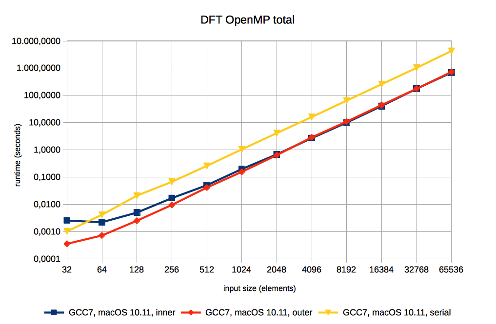

# Current design and implementation of DFT and FFT

The implementation is written in C programming language with the focus on being standard-compliant (according to the C11 standard), readable, and portable (in the sense of not using compiler extensions, OS- or hardware-specific code, but focusing on the x86-64 architecture), with a secondary goal of also trying to reach or exceed the performance of the FFTW3 (FFTW’s generality and adaptability are not in the scope of the implementation).
As of today, the primary goals can be considered achieved – the implementation is quite compact (s. below), compiles with multiple compilers (Clang, GCC, Intel, PGI) on MacOS and Linux without errors or warnings and as far as it was tested, produces correct results (if FFTW is taken as a reference). The secondary goal is not achieved yet, but the gap is not very large. Details and test results are listed below.
The next sections describe the structure of the program.

## Files

The current version contains 6 pairs of implementation files, a set of “main” files used to call all the other functions, and supplementary tools (makefiles, basic Doxygen template, simple visualization of the input and output data). The program folder contains files shown below:

* common.h / common.c
* complex.h / complex.c / my_fftw_complex.h
* ft_tools.h / ft_tools.c
* ft_common.h / ft_common.c
* dft.h / dft.c / dft_omp.c
* fft.h / fft.c / fft_omp.c
* run_dft.c / run_fft.c / run_fftw3.c / run_dft_omp.c / run_fft_omp.c
* makefiles: master.mk / clang3.mk / clang4.mk / gcc6.mk / gcc7.mk / intel.mk / pgi.mk
* tools: vis.py / dot2png.sh / Doxyfile / test.sh

### Makefiles and building the program

There are multiple files named after the compiler (incl. major version, if multiple versions were used), containing the flags and library paths for every specified compiler, and a “master” makefile, containing all the other definitions and build rules.
This way all the parameters can be shared between DFT, FFT and FFTW (if possible or applicable), to produce consistent results. And, if using the same makefile, also the same level of optimizations is applied to all the programs.
There are some definitions used to change the behavior of the program:

* N is the input data size (number of elements). If N is not defined, the value can be passed as a first parameter to the program.
* R is the number of repetitions of the complete cycle (forward-transform, backward- transform, normalization). If R is undefined, its value can be provided as the second parameter to the program (if N is defined, the first value gets ignored, but it’s still necessary to call the program with two parameters).
* PRINT_RESULTS to save the generated and result data to a file (if more than one repetition is executed, the result is printed only once after all calculations, so that possible errors would accumulate).
* INTERNAL_DOUBLE to set the internally used real_t data type to double precision floating point type. Single precision is used if the switch is not defined. For FFTW, additional care is needed, since there are two different libraries for single and double precision, so that the correct one has to be selected manually. Provided makefile targets fftw3f and fftw3d may be useful.
* INTERNAL_LONG to change the internally used int_t data type from unsigned int to unsigned long.
* FFT_IN_PLACE to change (only) FFT’s behavior between in-place and out-of- place. The function signature changes due to this switch (for in-place only one data array is passed into function, for out-of-place – two). The out-of-place version is simulated by copying the input array into the output and operating on the latter.
* INTERNAL_COMPLEX_STRUCT to be able to switch between different implementations of the complex data type. Struct containing two real_t variables is used if this switch is active. Additionally, macros RE and IM are defined to ensure portable access to the real and imaginary parts of the number.

Additional targets in the makefile are used to generate the compiler’s intermediate representation (IR/GIMPLE), ASM or CFG, useful to understand the optimizations applied by the compiler. Furthermore, the Doxyfile and the dot2png.sh script can also be used to better visualize the program structure.

### The implementation files

1. common.h / common.c: Here are the most general definitions and functions to create a consistent environment for the program (e.g. define constants that are missing in some libraries or substitute missing includes). Here are also the type definitions for the internal data types used in the entire program (int_t and real_t), so that they have to be redefined only in one place. Additionally, there is a get_time() function used for the portable and precise time measurement on Linux and MacOS. The files depend only on standard includes. For the get_time() function, the runtime library is needed (linker parameter -lrt on Linux).
2. complex.h / complex.c / my_fftw_complex.h: These files define the complex data type, macros RE and IM for a consistent access of the real and imaginary parts of the complex number, and routines for the complex arithmetics. The files have only one dependency – common.h. Since FFTW introduces its own complex data type, the my_fftw_complex header file is used to map FFTW’s functions and data types to my implementation. This header file includes fftw3.h and common.h.
3. ft_tools.h / ft_tools.c: Convenience functions for the input data generation, normalization, and printing. Depend on complex.h or my_fftw_complex.h using a preprocessor switch.
4. ft_common.h / ft_common.c: Contain the implementation of the internally used DFT / FFT data type, encapsulating all the necessary data (input, output, array length etc.). Besides that, there are two convenience functions for its initialization and cleanup. Depends only on the ft_tools.h.
5. dft.h / dft.c / dft_omp.c: Implementation of the DFT algorithm itself. To prevent cluttering of the source code, the OpenMP version is separated from the serial. The parallelization on this level is further called the “inner level” implementation, splitting the input array between threads. The files only depend on ft_common.h (and omp.h for the OpenMP version).
6. fft.h / fft.c / fft_omp.c: In a way similar to DFT, these files contain the FFT implementation as a serial version. The major difference is that the implementation itself is split into multiple functions. Additionally, there is an in-place and a simulated out-of-place version. The inner-level OpenMP version exists too, but doesn’t provide performance benefits yet, because the initialization of OpenMP introduces too much overhead to be useful. But this is not a final statement – maybe slightly different approaches can still be used. As with DFT, the single dependency for these files is ft_common.h (and omp.h).
7. The “main” files: Basically, they contain the necessary includes and the main-routine. Its structure is similar for all implementations – basic initialization of the used data type, time measurement, call to the real initialization of the data, calls to DFT/FFT, and output of the results / times. The main files only depend on the dft.h or fft.h accordingly. The OpenMP version in the main file is the “outer level” parallelization, so that the threads are executing DFT/FFT on different input arrays or running different repetitions. The FFTW version is slightly different, since it doesn’t use the data type and functions from ft_common.h. It depends directly on ft_tools.h. There is no OpenMP version of FFTW for the moment.

### Implementation details

1. DFT: The textbook DFT implementation is a nested loop, calculating the contribution of every frequency in a specific range to a total signal. So the outer loop is iterating over the frequencies, the inner loop calculates a sum of correlations between a sine curve of a given frequency and the original signal. The implemented out-of-place version is very close to the textbook, having only minor modifications, helping the compiler to optimize the code. It serves as an additional comparison for the performance of FFT.
2. FFT: The implemented version started as a classic (radix-2) FFT, but then incrementally and cautiously tuned to enable and improve the compiler optimizations, without losing the readability and structure. Further, some algorithmic improvements were tested and implemented: the Vandermonde matrix calculation is separated from the FFT itself and is precomputed, saving both – the computation time, and space, and there is an additional bit-reversal / shuffling algorithm, using a Grey Code and improving the performance of the array rearrangement. Other improvements are of rather technical nature, like avoiding double or multiple computations of the same variable or expression, changing loop structure to improve the memory access, removing unnecessary function calls etc.
3. FFTW3: For FFTW, only the main file is implemented. It uses the simple interface of FFTW, but the best plan is found by a measurement, not estimation.
4. OpenMP: Besides focusing on the performance comparison with FFTW, the shared-memory parallelization was also considered. Since multiple steps of DFT and FFT are independent from each other, OpenMP seems to be an interesting option for exploiting multiple cores of modern processors. Originally, for large data sizes, the best approach seemed to be an inner-level parallelization of the DFT/FFT routine to split the input data array between the threads. But with a focus shift to smaller input sizes, this approach loses much of the attractiveness, due to a significant overhead for OpenMP initialization. On the other hand, the parallelization on the uppermost level (parallel execution of the serial FFT calculations for different inputs) gets more interesting, but has to be evaluated further. Generally, DFT benefits a little bit more from the approach due to more regular data access patterns, so that for larger data sizes, a nearly linear speed-up could be achieved. For FFT and larger data sizes, multiple parts of the algorithm could be parallelized, but the total speed-up was much less significant than the one achieved for DFT. The evaluation of different OpenMP strategies for smaller data sizes is currently being done.

## Measurements

For the most measurements, a simple data set is used, generated from a combination of 2 sine functions over 2 periods, scaled to fill the entire input array. This data set has a benefit of being easy to compare visually, helpful to get the first impression of the quality of results. Since it’s encapsulated in a separate function, it can also be easily replaced for more sophisticated tests.

The tests are run on 2 different computers with different operating systems and libraries, and using multiple compilers, to ensure the portability of the implementation and to get a better impression of its performance on different systems. Additionally, multiple input sizes are used to better understand the scalability. Finally, the calculation of Fourier transform itself is repeated several times to eliminate or at least reduce random effects.

There are separate numbers for the initialization part and the Fourier part, which is especially important for the FFTW, since its plan performance measurement has a significant overhead (and gets even more time-consuming with large data sizes), but since it’s only done once per calculation type, it is not affecting the Fourier part, but only the initialization.
In the last part, some OpenMP-related results are presented, using the serial versions as a baseline. They show that additional performance can be unlocked with a relatively minor changes in the code and without sacrificing the portability.

One important fact that greatly affects performance is the way how the program parameters are passed into it. In my implementation, they can be introduced as compile-time constants (passed via makefile definitions) or as run-time parameters, specified on the command line. Depending on the compiler, there can be significant performance differences between these two ways, due to the different possibilities of compiler optimizations. For the simplicity, all the tests are done with command-line parameters.

The test data can be generated by using the provided bash script (tools/test.sh), which can be adapted according to requirements or different environments. In its current version, it has makefile- names, data sizes (currently from 32 to 65536) and the number of repetitions (at the moment 8, chosen to match the number of the CPU cores and thus the number of threads in “outer-level” parallelization) as variables. For every makefile, it removes the old executables, re-compiles all versions of the program (up to 7: dft, dft-omp-in, dft-omp-out, fft, fft-omp-in, fft-omp-out, fftw3f/fftw3d) and runs the executables, saving the generated results in the “numbers”-folder, in a file with a name based on the names of the makefile and the executable, e.g. “gcc6_fft-omp- out.txt”. Since DFT is relatively slow for the large numbers of N, the complete execution time of the script can be significant.

The time per iteration represents the entire cycle of forward- and backward-transformation and normalization. In case of FFT there are two additional array rearrangements (“shuffling” according to the bit-reversal algorithm). Since the overhead of normalization is rather negligible, compared to the Fourier part, the run time of a single DFT/FFT can be computed simply by dividing the iteration time by two.

### DFT

The first chart demonstrates the behavior of the DFT for different input sizes on a logarithmic scale. The runtime is a median value of all repetitions. All compilers show a linear increase, as expected, although there are large differences between their performance – a factor of 8x for the smallest input sizes, down to about 3.5x for the largest.

The second (above) and the third (below) charts compare the performance of the serial DFT with the two aforementioned OpenMP versions – the “inner”, where the parallelization is done in the DFT routine itself, thus creating the parallel region every time the function is called, and the “outer” – distributing the iterations in the main routine. Both versions are executed with 8 threads on the 8-core machines.

In this charts, the median of the iteration runtime is used, so that the only effect of introducing OpenMP in the “outer” version is an additional overhead. But it also shows that this overhead is not extremely high, albeit measurable. For the “inner” parallelization, on the other hand, OpenMP already pays off for small input sizes starting with 64 elements, and delivers up to 6.5x more performance for the largest considered size and GCC compiler, or more than 5x for the same data size and Intel compiler. GCC compiler on MacOS, while being the slowest overall, shows the best parallelization benefits, Intel on Linux, on the other hand, is the fastest in the long run, but the parallelization effect is the lowest of all tested combinations.

To see the benefits of the outer-level parallelization, the next two charts display the total runtime of the program with 8 iterations, using the same two compiler-computer pairs as before.

For the small data sizes, the “inner” version is the slowest one (for each compiler), because the OpenMP overhead for the creation of parallel region is introduced with every call to DFT, but for the larger sizes, the performance benefits of both versions are rather equal, due to the dominating computation time. Regarding the compilers, the GCC shows more linear behavior, but slower performance, Intel, on the other side, has a huge overhead for the small-sized inputs, but is significantly faster for larger ones. And in case of GCC, the “outer” version is faster than the serial one even for the smallest size, already delivering a speed-up of 4 for 128 elements.

Total runtime of the program with GCC (above) and Intel (below) compilers.

### FFT

The focus of this work was more on the FFT implementation and how it compares to the current state-of-the-art FFTW3 library. First, let’s see how the FFTW3 performance looks like on the tested systems.

The chart shows that all versions exhibit roughly the same behavior for the increasing input size, even if there are differences in performance between the fastest and the slowest version of roughly 8x, with GCC6 on Linux being the slowest. But since the comparisons between FFTW3 and this FFT implementation are done using the same compiler and computer, it should not be significant.
In the comparison between the FFTW3 and this FFT implementation, the Clang compiler on MacOS shows the best overall performance, with the average gap of less than 5x. The worst performance with being about 8x slower was measured with Intel Compiler on Ubuntu Linux. As I can imagine, the major reason for the gap is the vectorization – there are no explicit compiler- dependent intrinsics or the like in this implementation. The future compiler versions will most probably be better on automatic vectorization and thus reduce or even close the gap.

Here are the both charts: Clang above, Intel below. The results of other measured versions lay between these two.

And finally, the OpenMP parallelization of the FFT. Clang’s OpenMP implementation is still causing problems on the tested systems, so I will focus on GCC and Intel compilers for this part. We already saw that inner-level version of DFT was not really performant for small input sizes, due to the low amount of computations compared to the introduced overhead. Since FFT is generally faster (doing even less computing), it’s an expectable result that the “inner” parallelization is basically not working for FFT, at least for the considered configurations and input sizes. In the best cases (largest input) it barely reaches the performance of the serial version, so we can expect to see benefits only for much larger numbers of elements, which are out of the scope here.

The chart for the median of iterations with GCC on MacOS above, Intel on Linux below.

Outer-level parallelization, on the other hand, works pretty well, with GCC demonstrating the best parallelization benefits (up to 8x speed-up with 8 threads for larger input sizes) and Intel showing the best overall performance, surpassing the serial version by a factor of 4 on average and being able to deliver this performance even for the smallest input.

Again, GCC above, Intel below.
The strange outlier with Intel’s outer-level version and 1024-element input happened during multiple measurements. I can’t really explain it yet.

Additionally (even if it’s not a fair comparison), the OpenMP version with the Intel compiler delivers the same performance as the serial FFTW3 version, and the GCC compiler even undercuts FFTW’s serial runtime by a factor of 2 for larger sizes.

Finally, there is one more word to say about the compilers: since a couple of versions, both Intel and GCC have the auto-parallelization feature using PThreads (enabled by -parallel for the Intel compiler and -ftree-parallelize-loops for GCC) instead of additional libraries like OpenMP. This feature was disabled for the tests to avoid conflicts with OpenMP, but in independent measurements the unmodified serial DFT, compiled with the auto-parallelization, delivered basically the same performance as the OpenMP-parallelized version. This would mean that we can have multicore performance benefits without adding a single line to the code, just by the means of compilation with specific parameters.

## Appendix: Devices

Laptop (Macbook Pro)

* Hardware: 4-core i2635QM (“Sandy Bridge”, 2GHz, Hyperthreading), 8GB RAM
* Operating system: MacOS X “El Capitan” (10.11), 64-bit
* Compiler: (stock) Clang compiler (Apple’s version 8), Clang 4.0, GCC 7

Desktop

* Hardware: 4-core i920 (“Nehalem”, 2.67 GHz, Hyperthreading), 24GB RAM
* Operating system: Xubuntu Linux 17.04, 64-bit
* Compiler: Clang 4.0, GCC 6.3, Intel 17.0.3, PGI 16.10-0
